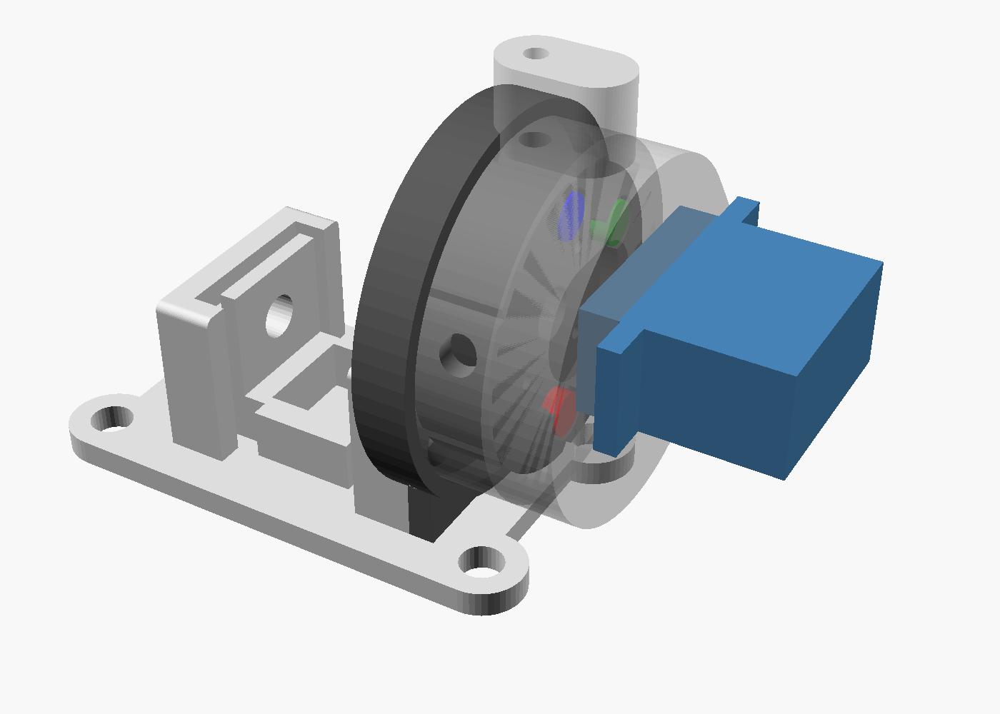

# LED turret for the photometer, draft 1

A servo-driven disc with four 5 mm LEDs. It brings one LED at a time in front of the LED hole of the existing photometer body (`../photometer-body.stl.stl`). A diffuser and an aperture stay fixed in the hole, so the cuvette always sees the same patch of light, whichever LED is in front.



`led_turret.scad` is the parametric OpenSCAD source; `stl/` holds the parts exported with the default values. **Measure your servo first** (see below), then export again:

```bash
openscad -D 'part="cup"' -o stl/cup.stl led_turret.scad
```

Parts: `front_plate`, `cup`, `disc`, `spacer`, `washer`, `diffuser`. `part="assembly"` shows everything on the body; `turn=0..3` picks the LED in front of the hole.

## How it fits the body

Measured from the body's STL, which matches the PDF drawing:

- **LED tower face:** 25 × 19 mm with 1 mm fillets. The drawing's 23 and 18 are measured between the fillets.
- **LED axis:** 15.5 mm above the underside, which is 12.5 mm above the base plate.
- **LED hole:** Ø7 × 3.5 mm counterbore, then Ø5.2 × 3.5 mm through to the cuvette.
- **Screw holes:** two, Ø2.6 × 3.5 mm deep, 10 mm either side of the LED hole. They are where your LED holder is screwed now.
- **The front plate** replaces the holder, using the same two holes. The screws must be **countersunk** and at most 6 mm long, for example M3 × 6 self-tapping, because the disc turns over their heads.

Envelope with the default servo: from the tower face it reaches about 39 mm outwards (plus the servo cable). It stands 56 mm above the underside at the detent boss, 47 mm at the cup, and is 44 mm wide. **Check that this fits in your enclosure.** If it's too tall, the detent can move to the side of the cup.

## Parts and printing

| Part | Material | Notes |
|---|---|---|
| front plate | black PETG or PLA | Print with the tower side down. |
| cup | black PETG | Print with the back wall down. The detent boss is a rib, so it needs no support. |
| disc | black PETG or PLA | Print with the front (LED tips) down. |
| spacer, washer | black | The washer is 0.8 mm thick with the 2.5 mm aperture. Print at 0.2 mm layers or finer. |
| diffuser | white or natural PLA, 1 mm | Or cut a Ø6.7 disc from 1 mm PTFE or opal acrylic, which diffuses better. |

Other parts:

- 1 micro servo: MG90S (metal gears) or SG90.
- 4 LEDs, 5 mm.
- 1 steel ball, 3 mm.
- 1 short spring. One from a ballpoint pen works.
- 1 M3 grub screw.
- 4 M2 self-tapping screws: 2 for the horn, 2 for the servo.
- 2 M3 × 6 countersunk screws.
- Thin silicone wire.

## Assembly

1. **Optics stack.** Drop these into the tower's Ø7 counterbore in this order: washer, diffuser, spacer. Screw the front plate over them.
2. **Disc.**
   - Push the LEDs into the disc from the back; the flanges sit in the counterbores.
   - Bend the legs flat and solder the wires.
   - Screw the round servo horn into the recess at the back of the disc. The pilot holes are on a 7.5 mm radius; drill through your horn's holes if they don't match.
3. **Servo.**
   - Seat the servo in the pocket on the back of the cup and screw its tabs down.
   - Set the servo to 0° **before** fitting the disc, then press the disc onto the shaft with LED 0 at the bottom.
   - Fit the horn screw through the centre hole of the disc.
4. **Detent.** Put the ball, then the spring, into the boss. Turn the grub screw in until the disc clicks into each position, but the servo still turns it easily.
5. **Close up.**
   - Route the five wires through the side hole.
   - Push the cup into the front plate's lip.
   - Seal the wire hole with black foam or hot glue.

## Measure your servo

These values in `led_turret.scad` depend on the servo and horn. The defaults are typical for an MG90S.

| Parameter | Default | What it is |
|---|---|---|
| `servo_l`, `servo_w` | 22.8, 12.2 | Case length and width. |
| `servo_shaft_off` | 6 | From the shaft centre to the near end of the case. |
| `servo_hole_pitch` | 27.8 | Distance between the two tab holes. |
| `servo_tab_drop` | 4.5 | From the top of the case down to the top face of the tabs. |
| `servo_shaft_h` | 4 | From the top of the case to the flat face of the horn, with the horn pressed on. |
| `servo_boss_d` | 12 | The round boss around the shaft. |
| `horn_d`, `horn_t`, `horn_hole_r` | 21, 2, 7.5 | Round horn: diameter, thickness, radius of the holes used. |

## Wiring and firmware

- **LEDs.**
  - The anodes are joined and go to the existing LED drive line.
  - Each cathode goes through its own logic-level N-MOSFET (2N7000 or BSS138) to ground, with the gates on four digital pins.
  - The firmware turns on one gate at a time, so a misconfigured board can't light two LEDs.
  - Leave a loose loop of wire: the disc only turns 180°.
- **Servo.**
  - Power it from a separate 5 V supply, sharing ground with the board, because USB can't supply its starting current.
  - Send the signal from a PWM pin.
  - Keep its wires away from the I²C wires.
- **Sequence for choosing a colour:**
  1. Set the LED power to 0 and switch off all the gates.
  2. Move the servo.
  3. Wait about 300 ms, then stop the servo pulses, so the detent holds the disc and the servo can't jitter during a reading.
  4. Switch on the chosen gate, set the power, and wait for the LED to settle.
- **Protocol.** The move takes longer than the protocol's 500 ms reply limit, so colour selection is asynchronous: `photometer:LEDSEL <colour>` replies `BUSY`, then `EVT DONE … color=<colour>`. `HW?` reports `leds=red,orange,green,blue changer=servo`.

## Repeatability test

Light one LED at a fixed power, then repeat 20 times: move to another LED and back, then take a reading.

- **Spread below about 0.3 %:** that is an absorbance error of about 0.001, so blanks can be measured for all colours first and then the samples.
- **Worse than that:** measure the blank again after every colour change.
